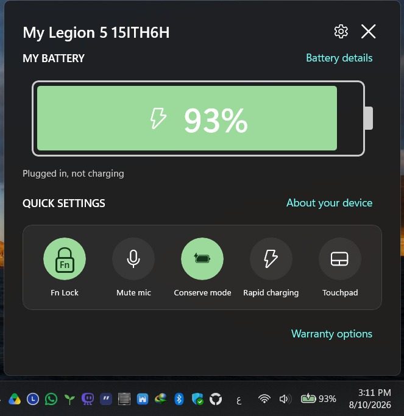
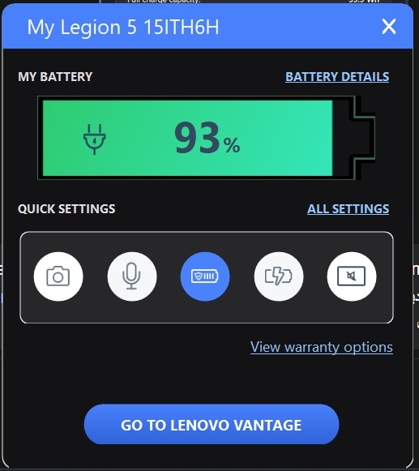
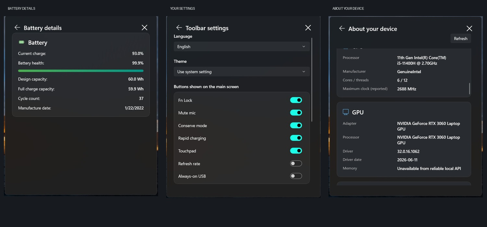

# Fluent Vantage Toolbar
### Your Legion. Your controls. One click from the tray.

A small Windows 11-style toolbar for Lenovo **Legion** and **LOQ** laptops.

[**Download**](../../releases) · [Features](#features) · [Screenshots](#screenshots) · [Compatibility](#compatibility) · [Installation](#installation) · [العربية](README.ar.md)

**Developed by Mohamed Elnaggar**  
*brought to you by app.instinct AI*

  

<em>The main flyout on the developer's own laptop. Battery, quick controls and device details, one click from the tray.</em>

---

## Why this project?

Fluent Vantage Toolbar is an independent replacement for the familiar Lenovo Vantage Toolbar.

> "I decided to build a similar Toolbar since Lenovo took this feature down in favor of the creepy widget. I took the concept from the original one, implemented the Windows 11 design language, and made it customizable a bit"
>
> - Mohamed Elnaggar, developer

### The original inspiration: Lenovo Vantage Toolbar

*The original concept: battery information and everyday controls, within reach of the taskbar. Fluent Vantage Toolbar reimplements the idea in its own code, with Windows 11 styling and customizable controls.*

It is **not an official Lenovo product**, a fork of Lenovo Vantage, or a replacement for every feature in the full Vantage app. Hardware support depends on the laptop's firmware and drivers.

## Screenshots

*Real screenshots from the developer's Legion 5 15ITH6H. Values shown belong to that device, not a promise about yours. These screenshots show v0.3.0; v0.3.1 updates the card icons and tray menu.*

## Features

| Everyday controls | What you get |
| :--- | :--- |
| Battery at a glance | Charge percentage and charging status in a compact flyout |
| Conserve mode | Switch to the device's battery-conservation mode |
| Rapid charging | Enable rapid charging where the firmware supports it |
| Mute mic | Mute active Windows microphone capture endpoints |
| Touchpad | Toggle the supported touchpad-lock route |
| Fn Lock | A quick Fn Lock control with a readable lock icon |
| Refresh rate | Enable the panel's high refresh rate, or switch it off to use the lower supported rate |
| Always-on USB | Toggle the supported always-on USB mode |

**Refresh rate and Always-on USB are hidden by default in v0.3.1.** Enable them in Settings if you want them. Existing saved choices are preserved.

<b>Explore the device cards</b>

The **About your device** page stays inside the toolbar. Scroll through cards for:

- Device identity, Windows version, BIOS and a masked serial number with a reveal button.
- Warranty dates from a cached result, with an explicit Lenovo warranty-check button.
- Platform and control availability, without guessing extra firmware features from a model name.
- CPU, GPU driver details, RAM modules and motherboard.
- Physical storage, local volumes and active display modes.
- Battery capacity, health, cycle count and manufacture date when available.
- Physical network adapters.

Some providers don't expose every value. Missing data is shown as unavailable. Dedicated GPU memory is not guessed from WMI's unreliable 32-bit `AdapterRAM` field.

<b>Make it yours</b>

- Light, dark or system theme.
- Choose which quick-control tiles appear.
- Battery-details and warranty links can be hidden.
- A tray icon keeps the app out of the way. Closing the flyout hides it; **Close app** exits it.
- Optional elevated startup task for launching with Windows without a repeated UAC prompt.
- Smooth custom flyout motion that respects Windows' animation setting. It is a hand-built effect, not the Start menu's private shell animation.

## Compatibility

| Model | Status | Notes |
| :--- | :--- | :--- |
| **Legion 5 15ITH6H (82JH)** | **Verified on the developer's machine** | Reference machine used for live testing. This is not certification of every control or every Windows/driver version. Fn's initial ON display is an assumption, not a reliable firmware read. |
| Other Legion models | Expected, unverified | Recognized Legion models are candidates. Each control is checked separately. Please report your model and any unavailable controls. |
| LOQ models | Expected, unverified | LOQ identity is recognized; firmware/control paths are not verified across the series. |
| IdeaPad / Yoga / Slim / ThinkBook | Not supported by this project | Outside the supported device family and protocol coverage. Models with `ACPI\VPC2004` can try [lenovo-battery-tray](https://github.com/sahidhh/lenovo-battery-tray); Yoga support there is expected, unverified. |
| ThinkPad | Not supported by this project | [lenovo-battery-tray](https://github.com/sahidhh/lenovo-battery-tray) also explicitly does not support ThinkPad. Neither project is a suitable ThinkPad recommendation. |

Please include your model, machine type, Windows version and the relevant error when reporting a problem. Review diagnostic logs before sharing them, and remove serial numbers or other private identifiers.

## Installation

Open [**Releases**](../../releases) and pick one package:

| Package | Best for | Requirement |
| :--- | :--- | :--- |
| `Setup-with-dotnet.exe` | Most users | Includes the required .NET runtime |
| `Setup.exe` | Users with the runtime already installed | .NET 8 Desktop Runtime, x64 |
| `portable-x64.zip` | Running without installation | Extract the entire ZIP; .NET 8 Desktop Runtime, x64 |

1. Use Windows 11 or a compatible x64 Windows environment with the required drivers.
2. Install your chosen package, or extract the portable ZIP.
3. Start **FluentLegionToolbar.exe**. The internal filename stays unchanged for upgrade/settings compatibility.
4. Open the tray icon, then use Settings to choose your theme, language and controls.

**Upgrades:** keep the same install folder. v0.3.1 adds shutdown verification before files are replaced. The release workflow tests a running v0.3.0-to-new-version upgrade before publication; check the build result before downloading a pending version.

Old releases are preserved. Future fixes receive new versions rather than silently replacing previous downloads.

## Languages

The interface offers English, Arabic, French, German, Italian, Spanish, Portuguese, Russian, Simplified Chinese and Japanese. Arabic uses right-to-left layout. Some newer device-detail text falls back to English where a translation is not yet available.

## Privacy and hardware notes

- Device inventory is read locally. The serial starts masked.
- Clicking **Check warranty with Lenovo** sends the device's serial number and machine type to Lenovo. Opening the device page alone does not perform that network request.
- Fn Lock starts ON in the UI by design. Startup does not write Fn Lock to the firmware.
- Unsupported or unreadable controls stay unavailable rather than pretending to work.
- Avoid running competing hardware-control tools at the same time.

## Credits

**Developer:** Mohamed Elnaggar  
**brought to you by app.instinct AI**

LenovoLegionToolkit was used as a hardware-interface reference, not as copied implementation. Dashboard icons come from Microsoft's MIT-licensed [Fluent UI System Icons](https://github.com/microsoft/fluentui-system-icons); see [THIRD-PARTY-NOTICES.txt](THIRD-PARTY-NOTICES.txt). Lenovo, Legion, LOQ and Vantage are trademarks of their owners. This project is independent and is not endorsed by Lenovo.
