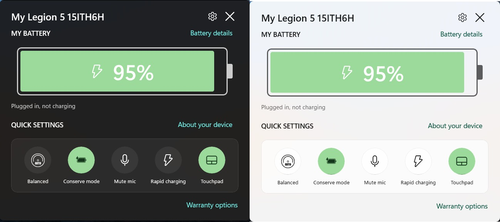
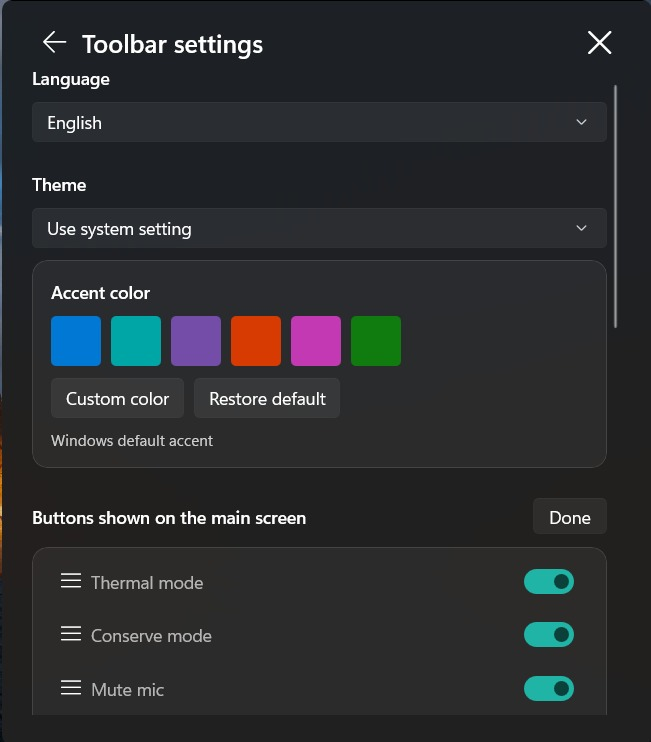
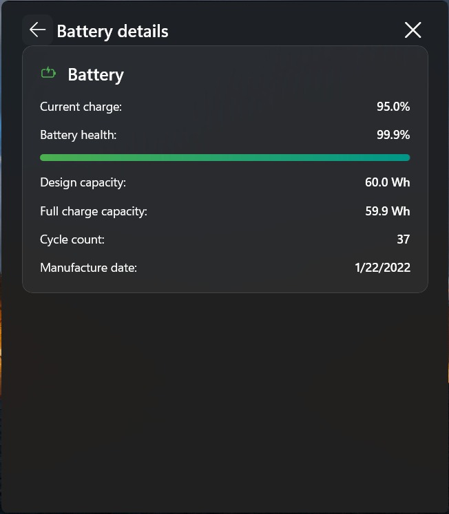
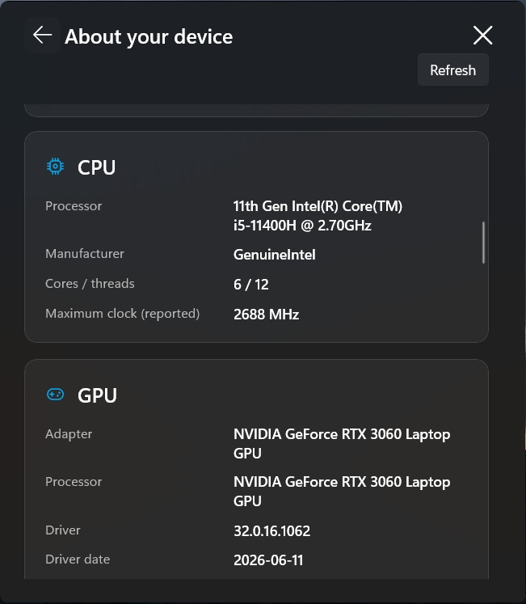
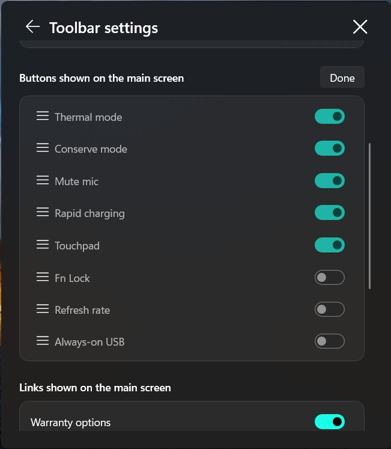

# Fluent Vantage Toolbar
### Battery status and quick controls for Legion and LOQ

A small Windows 11-style toolbar for Lenovo **Legion** and **LOQ** laptops.

[**Download**](../../releases) · [Features](#features) · [Screenshots](#screenshots) · [Compatibility](#compatibility) · [Installation](#installation) · [العربية](README.ar.md)

**Developed by Mohamed Elnaggar**  
[*brought to you by Instinct*](https://instinct.com)

  

<em>Main flyout on a Legion 5 15ITH6H.</em>

---

## Why this project?

Fluent Vantage Toolbar is an independent replacement for the familiar Lenovo Vantage Toolbar.

I built this toolbar after Lenovo removed the original feature in favor of its widget. I kept the concept I liked: battery information and quick controls right by the taskbar. Then I brought it into the Windows 11 design language and made the quick controls customizable.

### The original inspiration: Lenovo Vantage Toolbar

Independent project, not an official Lenovo product or a replacement for the full Vantage app.

## Screenshots

<table>
  <tr>
    <td align="center" width="50%"></td>
    <td align="center" width="50%"></td>
  </tr>
  <tr>
    <td align="center" width="50%"></td>
    <td align="center" width="50%"></td>
  </tr>
</table>

*Screenshots supplied by the developer from his Legion 5 15ITH6H.*

## Features

| Control | Function |
| :--- | :--- |
| Battery at a glance | Charge percentage and charging status in a compact flyout |
| Conserve mode | Switch to the device's battery-conservation mode |
| Rapid charging | Enable rapid charging where the firmware supports it |
| Mute mic | Mute active Windows microphone capture endpoints |
| Touchpad | Toggle the supported touchpad-lock route |
| Fn Lock | Toggle Fn Lock |
| Refresh rate | Enable the panel's high refresh rate, or switch it off to use the lower supported rate |
| Always-on USB | Toggle the supported always-on USB mode |

Refresh rate and Always-on USB are hidden by default. Enable them in Settings when needed; existing saved choices are preserved.

<b>Device information</b>

The **About your device** page contains scrollable cards for:

- Device identity, Windows version, BIOS and a masked serial number with a reveal button.
- Warranty dates from a cached result, with an explicit Lenovo warranty-check button.
- Platform and control availability, without guessing extra firmware features from a model name.
- CPU, GPU driver details, RAM modules and motherboard.
- Physical storage, local volumes and active display modes.
- Battery capacity, health, cycle count and manufacture date when available.
- Physical network adapters.

Unavailable hardware data is marked as such. Dedicated GPU memory is not inferred from WMI's unreliable `AdapterRAM` field.

<b>Appearance and behavior</b>

- Light, dark or system theme.
- Configurable tile visibility.
- Battery-details and warranty links can be hidden.
- Closing the flyout hides it; **Close app** exits the tray process.
- Optional elevated startup task for launching with Windows without a repeated UAC prompt.
- Custom show/hide animation, respecting Windows' animation setting.

### New customization and controls

- **Thermal mode:** read the current mode at startup without changing it, then click to cycle Quiet, Balanced and Performance. Performance requires AC power. The thermal tile replaces Fn Lock in the default layout; Fn Lock remains available in Settings.
- **Button ordering:** choose **Reorder** in Settings, drag the handles, then choose **Done**. Visibility toggles are disabled while reordering to avoid accidental changes. The order is saved using in-app pointer handling rather than elevated native drag/drop.
- **Themes and accent colors:** use the system, light or dark theme; choose from six accent presets, select a custom color (including hex input), or restore the default. Custom-accent hover and healthy-battery colors are supported.
- **Organized Settings and About:** language, theme/accent, buttons, links and diagnostics, with Updates at the bottom. About shows the app version, developer/contributor credits, **GitHub Repo Link** and a manual update check.
- **Update checks:** automatic checks are enabled by default, 45 seconds after launch and every six hours after that. Downloading and installing remain your choice. Manual checks are also available, and the download matches the current build's .NET package type.
- **Flyout behavior:** restored slide/fade show and hide animation, Mica backdrop and page fade/rise transitions. DWM cloaking avoids blank black frames when reopening from the tray; window resizing remains instant.
- **Installer improvements:** desktop and Start menu shortcuts, plus shutdown and verification of running toolbar instances before replacing files during upgrades.

## Compatibility

| Model | Status | Notes |
| :--- | :--- | :--- |
| **Legion 5 15ITH6H (82JH)** | **Verified on the developer's machine** | Reference machine for live testing; support may vary with firmware and drivers. |
| Other Legion models | Expected, unverified | Each control is checked separately; other models remain unverified. |
| LOQ models | Expected, unverified | LOQ identity is recognized; firmware/control paths are not verified across the series. |
| IdeaPad / Yoga / Slim / ThinkBook | Not supported by this project | Outside the supported device family and protocol coverage. Models with `ACPI\VPC2004` can try [lenovo-battery-tray](https://github.com/sahidhh/lenovo-battery-tray); Yoga support there is expected, unverified. |
| ThinkPad | Not supported by this project | [lenovo-battery-tray](https://github.com/sahidhh/lenovo-battery-tray) also explicitly does not support ThinkPad.  |

When reporting an issue, include your model, machine type, Windows version and the relevant error. Remove private identifiers from diagnostic logs before sharing them.

## Installation

Download a package from [**Releases**](../../releases):

| Package | Best for | Requirement |
| :--- | :--- | :--- |
| `Setup-with-dotnet.exe` | Most users | Includes the required .NET runtime |
| `Setup.exe` | Users with the runtime already installed | .NET 8 Desktop Runtime, x64 |
| `portable-x64.zip` | Running without installation | Extract the entire ZIP; .NET 8 Desktop Runtime, x64 |

Windows x64 and compatible Lenovo drivers are required. Portable packages must be fully extracted before running **FluentLegionToolbar.exe**; the executable name is retained for upgrade compatibility.

After installation, open the tray icon to access the toolbar. Choose your language, theme and visible tiles in Settings. The installer also offers an optional elevated startup task.

## Languages

The interface offers English, Arabic, French, German, Italian, Spanish, Portuguese, Russian, Simplified Chinese and Japanese. Arabic uses right-to-left layout. Some newer device-detail text falls back to English where a translation is not yet available.

## Privacy and hardware notes

- Device inventory is read locally. The serial starts masked.
- Clicking **Check warranty with Lenovo** sends the device's serial number and machine type to Lenovo. Opening the device page alone does not perform that network request.
- Fn Lock starts ON in the UI by design. Startup does not write Fn Lock to the firmware.
- Unsupported or unreadable controls remain unavailable.
- Competing hardware-control tools may interfere with each other.

## Credits

LenovoLegionToolkit was used as a hardware-interface reference, not as copied implementation. Dashboard icons come from Microsoft's MIT-licensed [Fluent UI System Icons](https://github.com/microsoft/fluentui-system-icons); see [THIRD-PARTY-NOTICES.txt](THIRD-PARTY-NOTICES.txt). Lenovo, Legion, LOQ and Vantage are trademarks of their owners.
